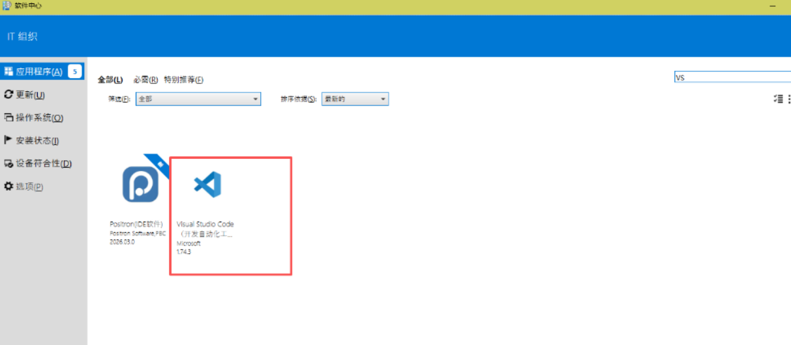

# 🤝 团队大模型使用指南 (入门必读)

为了让整个团队的同事们也能够快速用上大模型来赋能日常工作，请按照以下四个简单步骤环境配置您的本地环境（VSCode + GitHub Copilot）：

### 第一步：安装工具 (VSCode)
首先进入公司内部的 **软件中心**，在应用列表中搜索并下载安装 **Visual Studio Code**。

### 第二步：安装 AI 插件
安装完毕并打开 VSCode，找到最左侧边栏的 **“扩展 (Extensions)”** 图标（四个小方框组成的按钮）。直接在搜索栏输入 `copilot`，找到官方发布的 **GitHub Copilot Chat**，点击安装。

### 第三步：登录与授权
点击界面最左下角的 **人像账户（Account）** 图标。在弹出的菜单中选择登录，并在跳转的页面中**使用 GitHub 登录**，这里务必记得要**输入您公司邮箱里收到的用户名**来完成登录对接。

### 第四步：检查是否就绪
一切登录就绪后，把目光聚焦到 VSCode 的最下方状态栏。只要在 **屏幕的右下角** 看到一个可爱的 **“小机器人”** 图标，这意味着 Copilot 大模型已经被成功激活，处于随时待命状态，安装完毕可用！

---

# 顶尖 AI 模型对比与适用场景分析

由于 NotebookLM 最擅长处理结构化的文字与表格，这份笔记采用全图表形式整理，以达到最优的信息提取和阅读效果。

## 📊 核心能力热力图

*评分标准：🟩 卓越 (最佳级) | 🟨 推荐 (优秀级) | 🟧 够用 (普通级)*

| 评估维度 | Gemini 3.1 | GPT 5.4 | Claude Opus 4.6 | Claude Sonnet 4.6 |
| :--- | :---: | :---: | :---: | :---: |
| **逻辑与数学推理** | 🟨 推荐 | 🟩 卓越 | 🟩 卓越 | 🟨 推荐 |
| **创意与长文写作** | 🟨 推荐 | 🟨 推荐 | 🟩 卓越 | 🟨 推荐 |
| **代码编写与架构** | 🟨 推荐 | 🟩 卓越 | 🟨 推荐 | 🟩 卓越 |
| **超长文本处理(检索)**| 🟩 卓越 | 🟨 推荐 | 🟩 卓越 | 🟨 推荐 |
| **多模态(图频音)** | 🟩 卓越 | 🟩 卓越 | 🟨 推荐 | 🟧 够用 |
| **响应速度与执行力**| 🟨 推荐 | 🟧 够用 | 🟧 够用 | 🟩 卓越 |
| **综合性价比** | 🟨 推荐 | 🟧 够用 | 🟧 够用 | 🟩 卓越 |

---

## ⚖️ 模型优劣势与适用场景综合对比表

| AI 模型 | ✅ 核心优势 (Strengths) | ❌ 核心劣势 (Weaknesses) | 💡 建议适用场景 (Use Cases) |
| :--- | :--- | :--- | :--- |
| **GPT 5.4** *(OpenAI)* | 1. **不可撼动的逻辑上限**：复杂算法与数学推导最准 2. **最强生态系统**：系统扩展与各类工具调用稳如磐石 3. **代码绝对王者**：擅长极其复杂的流程与深层 Bug | 1. **资源成本偏高**：处理大规模长内容开销巨大 2. **不可避免的AI感**：行文八股，且响应速度相对不占优 | • 大型商业 Agent 的核心推理大脑 • 高难度算法、极端复杂代码攻坚 • 断层级解决超困难逻辑难题的最后防线 |
| **Claude Opus 4.6** *(Anthropic)* | 1. **极致语感**：拟人文本共情能力与行文思辨全品类最强 2. **超级阅读理解**：极其擅剖析复杂商业合同与杂乱长研报 3. **事实严谨度高**：极低幻觉，数据校对与交叉检查极准 | 1. **多媒体短板**：对视频与复杂复合媒体文件的指令稍显吃力 2. **偏慢且昂贵**：不适合用来进行高频的代码片段对答 | • 高质量博客写作、深情公文与精妙小说撰写 • 法律条款逐字甄别、厚重学术论文归纳 • 需要同理心与高情商的高级陪伴/客服助理 |
| **Claude Sonnet 4.6** *(Anthropic)* | 1. **黄金三角平衡**：速度快、智能高、价格公道的完美组合 2. **键盘神机**：Web 网页端开发与日常代码重构稳、准、极快 3. **自动化首选**：极速且低错，胜任作为流水线的核心接发中心 | 1. **思考深度不足**：遭遇核心数学前沿与深层学术难题时，逻辑退化 | • 担任 Cursor / Copilot 日常高频写码的主力 • 快速海量客服问答分发、日常会议与粗乱文本清洗 • 搭建企业批量流水线与高速 AI 代理网络工作流 |
| **Gemini 3.1** *(Google)* | 1. **多模态大满贯巅峰**：天生看懂音视频，无需通过文字中转 2. **巨无霸上下文**：随意容纳数百万 Token，直接阅读完整项目工程 3. **谷歌生态直连**：与世界级搜索引擎和内文深度无缝互通 | 1. **长剧本一致性差**：写极长且复杂的文件时容易弄丢前提或跑偏 2. **文本表达硬邦邦**：文风更接近生硬机器，人文温度不如 Claude | • 直接丢入长达几小时无字幕的监控录制、安防视频提取重点 • 无脑倾倒几百个文件构成的开源工程代码库进行源码解构 • 暴力提取复杂的跨页大图表和极其抽象混乱的 PDF 财报数据 |

---

## 🎯 一句话选型指南：
*   💻 **硬核逻辑/底层架构代码** 👉 选 `GPT 5.4`
*   ✍️ **撰写长文/精读晦涩长文档** 👉 选 `Claude Opus 4.6`
*   ⚡ **日常写代码飞快/高频打杂** 👉 选 `Claude Sonnet 4.6`
*   🎥 **看超长无声视频/吞入百万级代码库** 👉 选 `Gemini 3.1`
